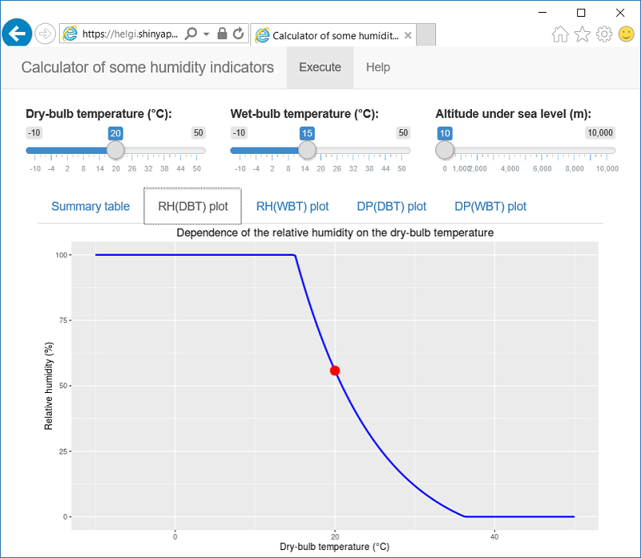

Humidity calculator
========================================================
author: Oleg Sémery
date: 
autosize: true

Introduction
========================================================

Humidity calculator estimates several simple humidity indicators:

1) [relative humidity](https://en.wikipedia.org/wiki/Relative_humidity),  
2) [absolute humidity](https://en.wikipedia.org/wiki/Humidity#Absolute_humidity),  
3) [dew point temperature](https://en.wikipedia.org/wiki/Dew_point).

For this purpose the application uses only:  

1) [dry-bulb temperature](https://en.wikipedia.org/wiki/Dry-bulb_temperature),  
2) [wet-bulb temperature](https://en.wikipedia.org/wiki/Wet-bulb_temperature),  
3) altitude under sea level.  

Also the application demonstrates several plots of RH and DP for research purposes.

Relative Humidity Formula
========================================================

There are a lot of formulas for the relative humidity, but we use the following set:

$$p^{*}_{H_2 O} (T,P) = \left( 1.0016 + 3.15 \cdot 10^{-6} \cdot P - 0.074 \cdot P^{-1} \right) \cdot 6.112 \cdot e^{\frac{17.62 \cdot T}{243.12 + T}}$$

$$p_{H_2 O} (DBT,WBT,P) = p^{*}_{H_2 O} (WBT,P) - 0.0007947 \cdot (DBT - WBT) \cdot P$$

$$RH(DBT,WBT,P) = \frac{p_{H_2 O} (DBT,WBT,P)}{p^{*}_{H_2 O} (DBT,P)}$$

Example of humidity calculation
========================================================


```r
dbt <- 20
wbt <- 15
h <- 10
p_hpa <- pascal_to_hectopascal(calc_air_pressure(dbt, h))
rh <- calc_relative_humidity(dbt,wbt,p_hpa)
ah <- calc_absolute_humidity(dbt, p_hpa)
dp <- calc_dew_point(dbt, rh)
kable(data.frame(DBT=dbt, WBT=wbt, H=h, RH=round(to_percent(rh),2), AH=round(ah,4), DP=round(dp,2)))
```


| DBT| WBT|  H|    RH|      AH|    DP|
|---:|---:|--:|-----:|-------:|-----:|
|  20|  15| 10| 55.79| 17.5321| 10.89|

Screenshot of the application
========================================================


